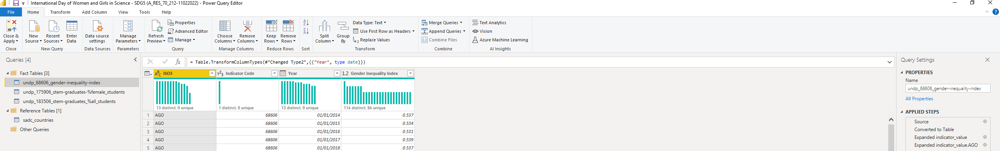
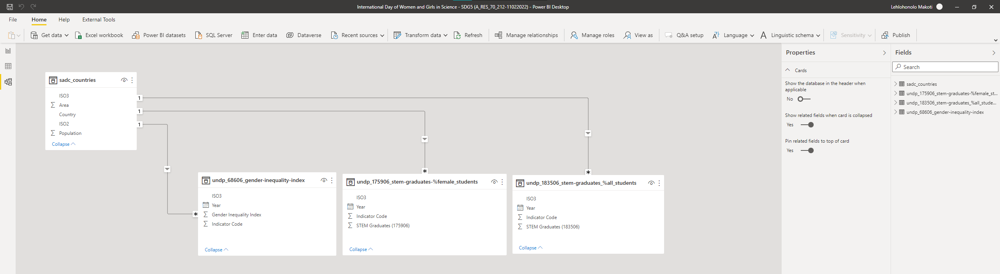

<h1 align="center">United Nations  International Day of Women and Girls in Science, 11 February 2022</a></h1>

## Architecture (ETL)

**Analytics Tool**: The image below depicts the query management structure in the Power Query Editor and the corresponding tables used to build out the model:

**Analytics Tool**: Microsoft PowerBI (https://powerbi.microsoft.com)

**UNDP Human Development Data Center**: The human development data are sourced from international data agencies with the mandate, resources, and expertise to collect national data on specific indicators unless otherwise noted.

### **Human Development Report Office Statistical Data API**

The Human Development Report Office (HDRO) offers this REST API for the developers to query human development related data in JSON format. The data can be queried by indicator id(s), year(s) and country code(s) and group by any order. 

**API Home**: http://ec2-54-174-131-205.compute-1.amazonaws.com/API/Information.php

## Extraction

**1. Gender Inequality Index (Indicator ID - 68606)**

A composite measure reflecting inequality in achievement between women  and men in three dimensions: reproductive health, empowerment and the  labour market.

> **Data Source:** HDRO calculations based on data in columns 3-9
>
> **URL:** http://hdr.undp.org/en/indicators/68606
>
> curl --location --request GET 'http://ec2-54-174-131-205.compute-1.amazonaws.com/API/HDRO_API.php/indicator_id=68606'

**2. Share of graduates in science, technology, engineering and mathematics programmes at tertiary level, female % (Indicator ID - 175906)**

Share of female tertiary graduates in science, technology, engineering  and mathematics programmes among all female tertiary graduates.

>  **Data Source:** UNESCO (United Nations Educational, Scientific and  Cultural Organization) Institute for Statistics (2020). Data Centre.  http://data.uis.unesco.org. Accessed 21 July 2020.
>
> **URL:** http://hdr.undp.org/en/indicators/175906
>
> curl --location --request GET 'http://ec2-54-174-131-205.compute-1.amazonaws.com/API/HDRO_API.php/indicator_id=175906'

**3. Share of graduates from science, technology, engineering and mathematics programmes in tertiary education who are female % (Indicator ID - 183506)**

Share of female graduates among all graduates of tertiary programmes in science, technology, engineering and mathematics.

> **Data Source:** UNESCO (United Nations Educational, Scientific and  Cultural Organization) Institute for Statistics (2020). Data Centre.  http://data.uis.unesco.org. Accessed 21 July 2020.
>
> **URL:** http://hdr.undp.org/en/indicators/183506
>
> curl --location --request GET 'http://ec2-54-174-131-205.compute-1.amazonaws.com/API/HDRO_API.php/indicator_id=183506'

## Transformation

Key Transformation Steps in PowerQuery - Using the M-Language [^PowerQuery-M]

> 1. **Load the source json formatted data**
>
>    = Json.Document(Web.Contents("http://ec2-54-174-131-205.compute-1.amazonaws.com/API/HDRO_API.php" & "/country_code=AGO,BWA,COM,COD,SWZ,LSO,MDG,MWI,MUS,MOZ,NAM,SYC,ZAF,TZA,ZMB,ZWE/indicator_id=" & "68606"))
>
>    **NB**: for each indicator change the indicator_id =  68606, 175906, 183506, use the country codes to filter and lessen the data import need for a lot of computational resources
>
> 2. **Create a *table from records*, using record field names as column names** 
>
>    = Table.FromRecords({Source})
>
> 3. **Translate all columns other than a specified set into attribute-value pairs, combined with the rest of the values in each row.** 
>
>    = Table.UnpivotOtherColumns(#"Changed Type", {}, "Attribute", "Value")
>
> 4. **Splits the specified columns into a set of additional columns using the specified splitter function** 
>
>    = Table.SplitColumn(#"Unpivoted Columns", "Attribute", Splitter.SplitTextByDelimiter(".", QuoteStyle.None), {"Attribute.1", "Attribute.2", "Attribute.3", "Attribute.4"})
>
> 5. **Returns a table with the rows removed from the input table that contain  an error in at least one of the cells. If a columns list is specified,  then only the cells in the specified columns are inspected for errors.** 
>
>    = Table.RemoveRowsWithErrors(#"Changed Type2", {"Index"})

## Load

Below is the loaded model of the tables created to produce the visuals, it uses the traditional Star Schema approach [^ Star Schema]

## License

This license lets others distribute, remix, adapt, and build upon your  work, even commercially, as long as they credit you for the original  creation. This is the most accommodating of licenses offered.  Recommended for maximum dissemination and use of licensed materials. (https://creativecommons.org/licenses/)

<!-- Footnotes, Definitions-->

[^PowerQuery-M]: Microsoft  Power Query provides a powerful data import experience that encompasses  many features. Power Query works with Analysis Services, Excel, and  Power BI workbooks. A core capability of Power Query is to filter and  combine, that is, to mash-up data from one or more of a rich collection  of supported data sources. Any such data mashup is expressed using the  Power Query M Formula Language. It's a functional, case sensitive  language similar to F#.

[^ Star Schema]: **Star schema** is a mature modeling approach widely  adopted by relational data warehouses. It requires modelers to classify  their model tables as either *dimension* or *fact*. (https://docs.microsoft.com/en-us/power-bi/guidance/star-schema)

<!-- Profile Links -->

[linkedin]: https://www.linkedin.com/in/lehlohonolomakoti/
[github]: https://www.github.com/lmakoti/
[facebook]: https://www.facebook.com/lmakoti/

<!-- Shields Profile Links -->

[linkedinbadge]: https://img.shields.io/badge/-uditkumarchatterjee-0e76a8?style=flat&labelColor=0e76a8&logo=linkedin&logoColor=white

