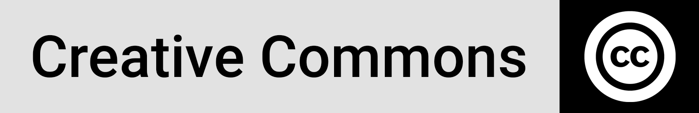

<h1 align="center">United Nations  International Day of Women and Girls in Science, 11 February 2022</a></h1>

## Architecture (ETL)

The image below depicts the query management structure in the Power Query Editor and the corresponding tables used to build out the model:

**Analytics Tool**: Tableau Desktop

## Extraction

## Transformation

## Load

## Networking

Connecting and building networks is always part of my priorities, please reach out if you have any ideas on collaborative efforts or any suggestions on ways I could improve my work, hopefully I would be as much usefulness to you in return. 

[][linkedin] [][github] [][facebook]

## License

This license lets others distribute, remix, adapt, and build upon your  work, even commercially, as long as they credit you for the original  creation. This is the most accommodating of licenses offered.  Recommended for maximum dissemination and use of licensed materials. (https://creativecommons.org/licenses/)

<!-- Footnotes, Definitions-->

[^PowerQuery-M]: Microsoft  Power Query provides a powerful data import experience that encompasses  many features. Power Query works with Analysis Services, Excel, and  Power BI workbooks. A core capability of Power Query is to filter and  combine, that is, to mash-up data from one or more of a rich collection  of supported data sources. Any such data mashup is expressed using the  Power Query M Formula Language. It's a functional, case sensitive  language similar to F#.

[^ Star Schema]: **Star schema** is a mature modeling approach widely  adopted by relational data warehouses. It requires modelers to classify  their model tables as either *dimension* or *fact*. (https://docs.microsoft.com/en-us/power-bi/guidance/star-schema)

<!-- Profile Links -->

[linkedin]: https://www.linkedin.com/in/lehlohonolomakoti/
[github]: https://www.github.com/lmakoti/
[facebook]: https://www.facebook.com/lmakoti/

<!-- Shields Profile Links -->

[linkedinbadge]: https://img.shields.io/badge/-uditkumarchatterjee-0e76a8?style=flat&labelColor=0e76a8&logo=linkedin&logoColor=white

