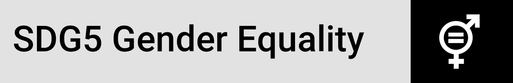
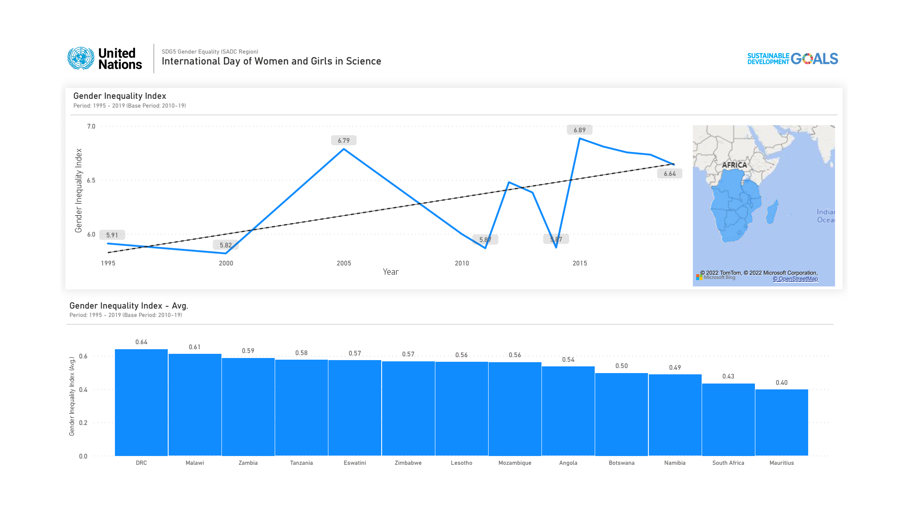
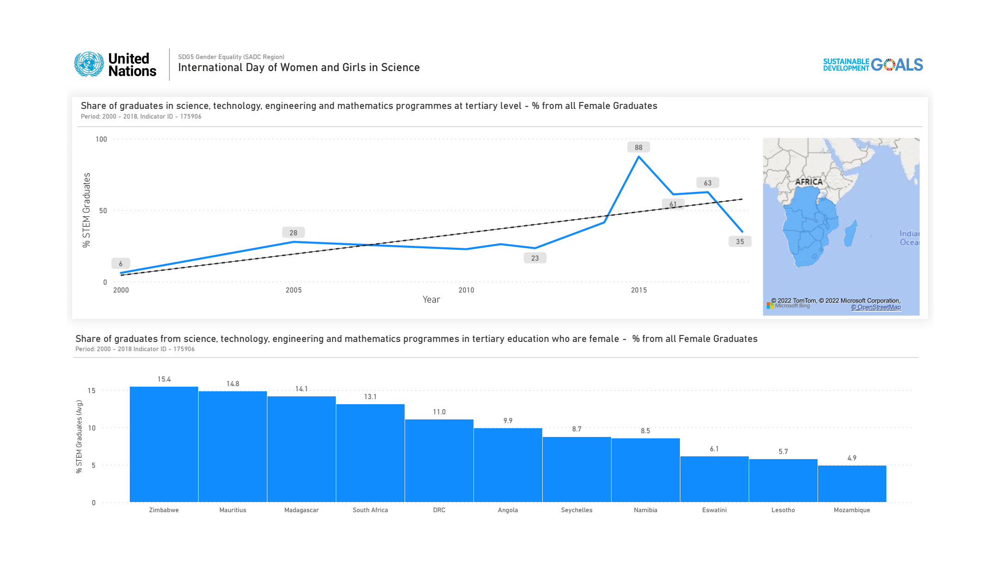
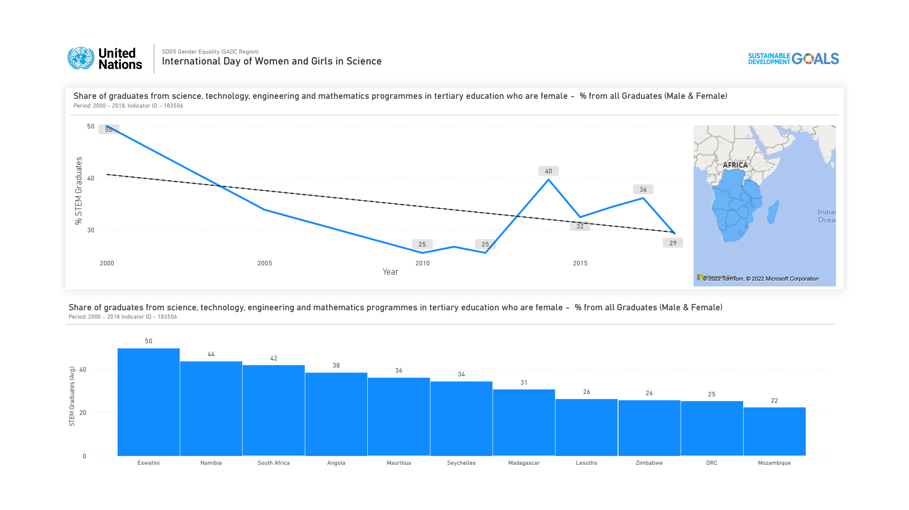

<h1 align="center">United Nations  International Day of Women and Girls in Science, 11 February 2022</a></h1>

  <a href="#overview">Overview</a> •
  <a href="#architecture">Architecture</a> •
  <a href="#definitions">Definitions</a> •
  <a href="#dashboard">Dashboard</a> •
  <a href="#networking">Networking</a> •
  <a href="#license">License</a>

## Overview

**Full and equal access and participation for women and girls in science**

<em>An adolescent girl conducts an experiment during a chemistry class in Kamulanga Secondary School in Lusaka, Zambia,  Photo:UNICEF Photo/UN0145554/Karin Schermbrucker </em>

****

Science and gender equality are both vital for the achievement of the internationally agreed development goals, including the 2030 Agenda for Sustainable Development. Over the past decades, the global community  has made a lot of effort in inspiring and engaging women and girls in  science. Yet women and girls continue to be excluded from participating  fully in science.

In order to achieve full and equal access to and participation in  science for women and girls, and further achieve gender equality and the empowerment of women and girls, the United Nations General Assembly  declared 11 February as the International Day of Women and Girls in  Science in 2015. [^UN Observance]

### SDG5 Gender Equality

**Achieve gender equality and empower all women and girls**

Target 5.b: Enhance the use of enabling technology, in particular information and communications technology, to promote the empowerment of women [^Target 5.b]

## Architecture

**Detailed Architecture Overview**: <a href="02_ETL Architecture/README.md" target="_blank">More Details</a>

UNDP Human Development Data Center: The human development data are sourced from international data agencies with the mandate, resources, and expertise to collect national data on specific indicators unless otherwise noted.

**Human Development Report Office Statistical Data API**

The Human Development Report Office (HDRO) offers this REST API for the developers to query human development related data in JSON format. The data can be queried by indicator id(s), year(s) and country code(s) and group by any order. 

**API Home**: http://ec2-54-174-131-205.compute-1.amazonaws.com/API/Information.php

**Using the API**

Users should query the API using the GET method. The resource selection can be done using single or multiple strings, as follows: country_code = 'AFG' indicator_id = '72206' year = '1980, 1990, 2019'

**The options selection is by default set to**: Data Structure: structure = ciy [ciy, yic, yci, iyc, icy]

http://ec2-54-174-131-205.compute-1.amazonaws.com/API/HDRO_API.php/country_code=AFG,ZWE/indicator_id=103206,103606,103706/year=1990,2013,2019/structure=ciy

**Data Minimisation (GDPR)**

**URL:** http://ec2-54-174-131-205.compute-1.amazonaws.com/API/HDRO_API.php/country_code=AGO,BWA,COM,COD,SWZ,LSO,MDG,MWI,MUS,MOZ,NAM,SYC,ZAF,TZA,ZMB,ZWE/indicator_id=indicator_placeholder

**Indicators Placeholder:** 68606, 175906, 183506

## Definitions

**1. Gender Inequality Index (Indicator ID - 68606)**

A composite measure reflecting inequality in achievement between women  and men in three dimensions: reproductive health, empowerment and the  labour market.

**Data Source:** HDRO calculations based on data in columns 3-9

**URL:** http://hdr.undp.org/en/indicators/68606

**2. Share of graduates in science, technology, engineering and mathematics programmes at tertiary level, female % (Indicator ID - 175906)**

Share of female tertiary graduates in science, technology, engineering  and mathematics programmes among all female tertiary graduates.

**Data Source:** UNESCO (United Nations Educational, Scientific and  Cultural Organization) Institute for Statistics (2020). Data Centre.  http://data.uis.unesco.org. Accessed 21 July 2020.

**URL:** http://hdr.undp.org/en/indicators/175906

**3. Share of graduates from science, technology, engineering and mathematics programmes in tertiary education who are female % (Indicator ID - 183506)**

Share of female graduates among all graduates of tertiary programmes in science, technology, engineering and mathematics.

**Data Source:** UNESCO (United Nations Educational, Scientific and  Cultural Organization) Institute for Statistics (2020). Data Centre.  http://data.uis.unesco.org. Accessed 21 July 2020.

**URL:** http://hdr.undp.org/en/indicators/183506

## Dashboard

**Dashboard Download (PDF, PBIX)**: <a href="International Day of Women and Girls in Science - SDG5 (A_RES_70_212-11022022).pdf">PDF Download</a> , <a href="International Day of Women and Girls in Science - SDG5 (A_RES_70_212-11022022).pbix">PowerBI Download (PBIX)</a>

1. **Page 01 - Gender Inequality Index (Indicator ID - 68606)**

2. **Page 02 - Share of graduates in science, technology, engineering and mathematics programmes at tertiary level, female % (Indicator ID - 175906)**

3. **Page 03 - Share of graduates from science, technology, engineering and mathematics programmes in tertiary education who are female % (Indicator ID - 183506)**

## Sponsors

> Codepool.tech (https://www.codepool.tech)  
> **Tsepo Thoabala, Software Engineer** (https://tmthoabala.codepool.tech/)  
> **Email:** info@codepool.tech

> Girls-Coding-Academy (https://www.facebook.com/girlscodingacademy.ls)  
> **'Maneo Mapharisa** (https://www.linkedin.com/in/maneo-mapharisa-464814178/) 
> **Facebook:** https://www.facebook.com/girlscodingacademy.ls

## Networking

Connecting and building networks is always part of our priorities, please reach out if you have any ideas on collaborative efforts or any suggestions on ways we could improve our work, hopefully we would be as much usefulness to you in return. 

> **Tebello Mokhele, Revenue Assurance Specialist (Vodacom, Vodafone Group)**
>
> LinkedIn - https://www.linkedin.com/in/tebello-mokhele-25009b98/

>  **Tsepo Makhupane, Project Lead (Vodacom, Vodafone Group)**
>
> LinkedIn - https://www.linkedin.com/in/tsepo-makhupane-a9a74b16/

> **Lehlohonolo Makoti, Data Management and Analytics Specialist (Commonwealth, Secretariat)**
>
> LinkedIn - https://www.linkedin.com/in/lehlohonolomakoti/

## License

This license lets others distribute, remix, adapt, and build upon your  work, even commercially, as long as they credit you for the original  creation. This is the most accommodating of licenses offered.  Recommended for maximum dissemination and use of licensed materials. (https://creativecommons.org/licenses/)

____

## **Reference**

1. SDG5: Gender Inequality, 2022, Target 5.b: https://sdgs.un.org/goals/goal5
2. UN Observance, 2022, Article: https://www.un.org/en/observances/women-and-girls-in-science-day

<!--Footnotes-->

[^Target 5.b]: https://sdgs.un.org/goals/goal5

[^UN Observance]: https://www.un.org/en/observances/women-and-girls-in-science-day

<!-- Profile Links -->

[linkedin]: https://www.linkedin.com/in/lehlohonolomakoti/
[github]: https://www.github.com/lmakoti/
[facebook]: https://www.facebook.com/lmakoti/

<!-- Shields Profile Links -->

[linkedinbadge]: https://img.shields.io/badge/-uditkumarchatterjee-0e76a8?style=flat&labelColor=0e76a8&logo=linkedin&logoColor=white

